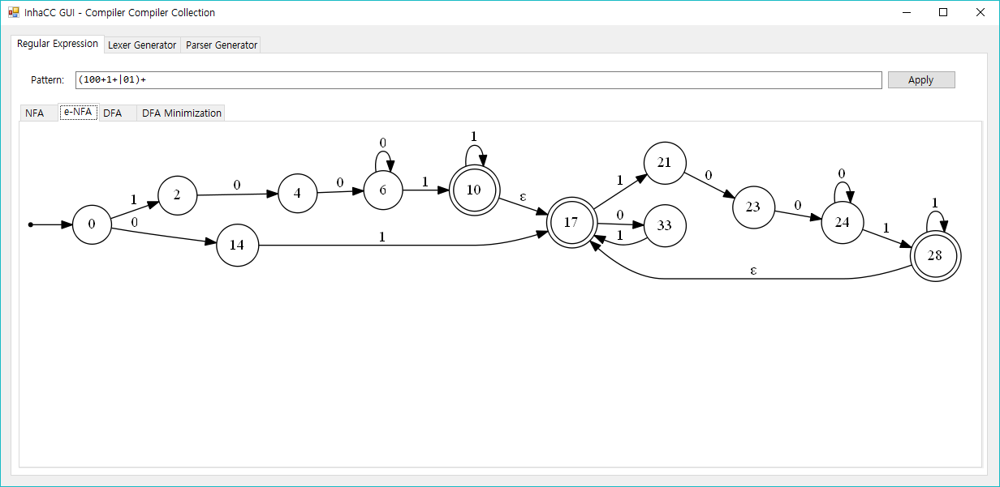

# compiler-compiler (GUI Toolkit for Parsing Components)



Compiler Compiler based on CSharp

Supports RE to NFA, e-NFA, NFA to DFA, DFA Minimization, Lexical Analyzer Generator, SLR, LALR(from LR(1)), LALR(from LR(0)), LR(1) Parser Generator.

If you want to use my code, use ParserGenerator.cs and ScannerGenerator.cs in the top folder.

Graphviz is required to use the graph visualization feature of Regular Expression. 

https://graphviz.gitlab.io/

## Release 1.3 (2020-05-14)

Binary: https://github.com/rollrat/compiler-compiler/releases/download/1.3/Release.zip

Dependency(GraphViz): https://graphviz.gitlab.io/_pages/Download/Download_windows.html

## Example - Json Parser

Json Lexer/Parser Generator: https://github.com/rollrat/compiler-compiler/tree/master/CC/CC/Program.cs

C++ Version: https://github.com/rollrat/jsonhead

C# Version: https://github.com/rollrat/compiler-compiler/tree/master/CC/JsonParser

Javascript Lexer/Parser Generator: https://github.com/rollrat/compiler-compiler/tree/master/CC/JavascriptParser

## Regular Expression (Regex)

### Example of Floating Point Number

`[0-9]+(\.[0-9]+)?([Ee][\+\-]?[0-9]+)?`


### Example 2

`(100+1+|01)+`

https://www.acmicpc.net/problem/1013


### How to use?

You cannot use this just to test regex.

## Scanner Generator / Lexical Analyzer Generator


A tool for analyzing regular expressions using `(`,`)`,`+`,`*`,`?`,`|`,`[`,`]`,`^`,`.` as tokens and generating Scanner tables.

### Example

``` cs
var sg = new ScannerGenerator();
sg.PushRule("", "[\\r\\n ]");
sg.PushRule("if", "if");
sg.PushRule("for", "for");
sg.PushRule("else", "else");
sg.PushRule("id", "[a-z][a-z0-9]*");
sg.PushRule("num", "[0-9]+");
sg.Generate();
sg.PrintDiagram();
 
var scanner = sg.CreateScannerInstance();
scanner.AllocateTarget("+/a1321    if else 0415abse+9999");
while (scanner.Valid())
{
    var ss = scanner.Next();
    Console.WriteLine($"{ss.Item1}, {ss.Item2}");
}
```

```
plus, +
id, a1321 // Ignore '/'
if, if
else, else
num, 0415
id, abse
plus, +
num, 9999
```

## Parser Generator


This source code includes the SLR, LR(1), and LALR parser generators.

### SLR Generator

``` cs
var gen = new ParserGenerator();

// Non-Terminals
var exp = gen.CreateNewProduction("exp", false);
var term = gen.CreateNewProduction("term", false);
var factor = gen.CreateNewProduction("factor", false);

// Terminals
var plus = gen.CreateNewProduction("plus");
var minus = gen.CreateNewProduction("minus");
var multiple = gen.CreateNewProduction("multiple");
var divide = gen.CreateNewProduction("divide");
var id = gen.CreateNewProduction("id");
var op_open = gen.CreateNewProduction("op_open");
var op_close = gen.CreateNewProduction("op_close");

exp |= exp + plus + term;
exp |= term;
term |= term + multiple + factor;
term |= factor;
factor |= op_open + exp + op_close;
factor |= id;

gen.PushStarts(exp);
gen.Generate();
gen.PrintStates();
```

```
I0 => SHIFT{(exp,I1),(term,I2),(factor,I3),(op_open,I4),(id,I5)}
I1 => SHIFT{(plus,I6)}
      REDUCE{($,accept,0)}
I2 => SHIFT{(multiple,I7)}
      REDUCE{(plus,exp,1),(op_close,exp,1),($,exp,1)}
I3 => REDUCE{(multiple,term,1),(plus,term,1),(op_close,term,1),($,term,1)}
I4 => SHIFT{(exp,I8),(term,I2),(factor,I3),(op_open,I4),(id,I5)}
I5 => REDUCE{(multiple,factor,1),(plus,factor,1),(op_close,factor,1),($,factor,1)}
I6 => SHIFT{(term,I9),(factor,I3),(op_open,I4),(id,I5)}
I7 => SHIFT{(factor,I10),(op_open,I4),(id,I5)}
I8 => SHIFT{(op_close,I11),(plus,I6)}
I9 => SHIFT{(multiple,I7)}
      REDUCE{(plus,exp,0),(op_close,exp,0),($,exp,0)}
I10 => REDUCE{(multiple,term,0),(plus,term,0),(op_close,term,0),($,term,0)}
I11 => REDUCE{(multiple,factor,0),(plus,factor,0),(op_close,factor,0),($,factor,0)}
```

### LR(1) Generator

```
var gen = new ParserGenerator();

// Non-Terminals
var exp = gen.CreateNewProduction("exp", false);
var term = gen.CreateNewProduction("term", false);
var factor = gen.CreateNewProduction("factor", false);
var func = gen.CreateNewProduction("func", false);
var arguments = gen.CreateNewProduction("args", false);
var args_left = gen.CreateNewProduction("args_left", false);

// Terminals
var plus = gen.CreateNewProduction("plus");         // +
var minus = gen.CreateNewProduction("minus");       // -
var multiple = gen.CreateNewProduction("multiple"); // *
var divide = gen.CreateNewProduction("divide");     // /
var id = gen.CreateNewProduction("id");             // [_$a-zA-Z][_$a-zA-Z0-9]*
var op_open = gen.CreateNewProduction("op_open");   // (
var op_close = gen.CreateNewProduction("op_close"); // )
var num = gen.CreateNewProduction("num");           // [0-9]+
var split = gen.CreateNewProduction("split");       // ,

exp |= exp + plus + term;
exp |= exp + minus + term;
exp |= term;
term |= term + multiple + factor;
term |= term + divide + factor;
term |= factor;
factor |= op_open + exp + op_close;
factor |= num;
factor |= id;
factor |= func;
func |= id + op_open + arguments + op_close;
arguments |= args_left + id;
arguments |= ParserGenerator.EmptyString;
args_left |= args_left + id + split;
args_left |= ParserGenerator.EmptyString;

gen.PushStarts(exp);
gen.GenerateLR1();
gen.PrintStates();
var slr = gen.CreateShiftReduceParserInstance();

// 2*4+5$

Action<string, string> insert = (string x, string y) =>
{
    slr.Insert(x, y);
    while (slr.Reduce())
    {
        var l = slr.LatestReduce();
        Console.Instance.Write(l.Produnction.PadLeft(8) + " => ");
        Console.Instance.WriteLine(string.Join(" ", l.Childs.Select(z => z.Produnction)));
        Console.Instance.Write(l.Produnction.PadLeft(8) + " => ");
        Console.Instance.WriteLine(string.Join(" ", l.Childs.Select(z => z.Contents)));
        slr.Insert(x, y);
    }
};

var sg2 = new ScannerGenerator();
sg2.PushRule("", "[\\r\\n ]");
sg2.PushRule("plus", "\\+");
sg2.PushRule("minus", "-");
sg2.PushRule("multiple", "\\*");
sg2.PushRule("divide", "\\/");
sg2.PushRule("op_open", "\\(");
sg2.PushRule("op_close", "\\)");
sg2.PushRule("split", ",");
sg2.PushRule("id", "[a-z][a-z0-9]*");
sg2.PushRule("num", "[0-9]+");
sg2.Generate();
sg2.CreateScannerInstance();

var scanner2 = sg2.CreateScannerInstance();
//scanner2.AllocateTarget("2+6*(6+4*7-2)+sin(a,b,c,d)+cos()*pi");
scanner2.AllocateTarget("2+6*(6+4*7-2)+sin(a,b,c,d)+cos()*pi");

while (scanner2.Valid())
{
    var ss = scanner2.Next();
    insert(ss.Item1,ss.Item2);
}
insert("$", "$");
```

```
-----I0-----
        S' -> ·exp                          $
       exp -> ·exp plus term                $/plus/minus
       exp -> ·exp minus term               $/plus/minus
       exp -> ·term                         $/plus/minus
      term -> ·term multiple factor         $/multiple/divide
      term -> ·term divide factor           $/multiple/divide
      term -> ·factor                       $/multiple/divide
    factor -> ·op_open exp op_close         $
    factor -> ·num                          $
    factor -> ·id                           $
    factor -> ·func                         $
      func -> ·id op_open args op_close     $
      func -> ·id op_open op_close          $

-----I1-----
        S' -> exp ·                         $
       exp -> exp ·plus term                $/plus/minus
       exp -> exp ·minus term               $/plus/minus

-----I2-----
       exp -> term ·                        $/plus/minus
      term -> term ·multiple factor         $/multiple/divide
      term -> term ·divide factor           $/multiple/divide

-----I3-----
      term -> factor ·                      $/multiple/divide

-----I4-----
    factor -> op_open ·exp op_close         $
       exp -> ·exp plus term                op_close/plus/minus
       exp -> ·exp minus term               op_close/plus/minus
       exp -> ·term                         op_close/plus/minus
      term -> ·term multiple factor         op_close/multiple/divide
      term -> ·term divide factor           op_close/multiple/divide
      term -> ·factor                       op_close/multiple/divide
    factor -> ·op_open exp op_close         op_close
    factor -> ·num                          op_close
    factor -> ·id                           op_close
    factor -> ·func                         op_close
      func -> ·id op_open args op_close     op_close
      func -> ·id op_open op_close          op_close

-----I5-----
    factor -> num ·                         $

-----I6-----
    factor -> id ·                          $
      func -> id ·op_open args op_close     $
      func -> id ·op_open op_close          $

-----I7-----
    factor -> func ·                        $

-----I8-----
       exp -> exp plus ·term                $/plus/minus
      term -> ·term multiple factor         $/plus/minus/multiple/divide
      term -> ·term divide factor           $/plus/minus/multiple/divide
      term -> ·factor                       $/plus/minus/multiple/divide
    factor -> ·op_open exp op_close         $/plus/minus
    factor -> ·num                          $/plus/minus
    factor -> ·id                           $/plus/minus
    factor -> ·func                         $/plus/minus
      func -> ·id op_open args op_close     $/plus/minus
      func -> ·id op_open op_close          $/plus/minus

-----I9-----
       exp -> exp minus ·term               $/plus/minus
      term -> ·term multiple factor         $/plus/minus/multiple/divide
      term -> ·term divide factor           $/plus/minus/multiple/divide
      term -> ·factor                       $/plus/minus/multiple/divide
    factor -> ·op_open exp op_close         $/plus/minus
    factor -> ·num                          $/plus/minus
    factor -> ·id                           $/plus/minus
    factor -> ·func                         $/plus/minus
      func -> ·id op_open args op_close     $/plus/minus
      func -> ·id op_open op_close          $/plus/minus

-----I10-----
      term -> term multiple ·factor         $/multiple/divide
    factor -> ·op_open exp op_close         $/multiple/divide
    factor -> ·num                          $/multiple/divide
    factor -> ·id                           $/multiple/divide
    factor -> ·func                         $/multiple/divide
      func -> ·id op_open args op_close     $/multiple/divide
      func -> ·id op_open op_close          $/multiple/divide

-----I11-----
      term -> term divide ·factor           $/multiple/divide
    factor -> ·op_open exp op_close         $/multiple/divide
    factor -> ·num                          $/multiple/divide
    factor -> ·id                           $/multiple/divide
    factor -> ·func                         $/multiple/divide
      func -> ·id op_open args op_close     $/multiple/divide
      func -> ·id op_open op_close          $/multiple/divide

-----I12-----
    factor -> op_open exp ·op_close         $
       exp -> exp ·plus term                op_close/plus/minus
       exp -> exp ·minus term               op_close/plus/minus

-----I13-----
       exp -> term ·                        op_close/plus/minus
      term -> term ·multiple factor         op_close/multiple/divide
      term -> term ·divide factor           op_close/multiple/divide

-----I14-----
      term -> factor ·                      op_close/multiple/divide

-----I15-----
    factor -> op_open ·exp op_close         op_close
       exp -> ·exp plus term                op_close/plus/minus
       exp -> ·exp minus term               op_close/plus/minus
       exp -> ·term                         op_close/plus/minus
      term -> ·term multiple factor         op_close/multiple/divide
      term -> ·term divide factor           op_close/multiple/divide
      term -> ·factor                       op_close/multiple/divide
    factor -> ·op_open exp op_close         op_close
    factor -> ·num                          op_close
    factor -> ·id                           op_close
    factor -> ·func                         op_close
      func -> ·id op_open args op_close     op_close
      func -> ·id op_open op_close          op_close

-----I16-----
    factor -> num ·                         op_close

-----I17-----
    factor -> id ·                          op_close
      func -> id ·op_open args op_close     op_close
      func -> id ·op_open op_close          op_close

-----I18-----
    factor -> func ·                        op_close

-----I19-----
      func -> id op_open ·args op_close     $
      func -> id op_open ·op_close          $
      args -> ·args_left id                 op_close
      args -> ·id                           op_close
 args_left -> ·args_left id split           id
 args_left -> ·id split                     id

-----I20-----
       exp -> exp plus term ·               $/plus/minus
      term -> term ·multiple factor         $/plus/minus/multiple/divide
      term -> term ·divide factor           $/plus/minus/multiple/divide

-----I21-----
      term -> factor ·                      $/plus/minus/multiple/divide

-----I22-----
    factor -> op_open ·exp op_close         $/plus/minus
       exp -> ·exp plus term                op_close/plus/minus
       exp -> ·exp minus term               op_close/plus/minus
       exp -> ·term                         op_close/plus/minus
      term -> ·term multiple factor         op_close/multiple/divide
      term -> ·term divide factor           op_close/multiple/divide
      term -> ·factor                       op_close/multiple/divide
    factor -> ·op_open exp op_close         op_close
    factor -> ·num                          op_close
    factor -> ·id                           op_close
    factor -> ·func                         op_close
      func -> ·id op_open args op_close     op_close
      func -> ·id op_open op_close          op_close

-----I23-----
    factor -> num ·                         $/plus/minus

-----I24-----
    factor -> id ·                          $/plus/minus
      func -> id ·op_open args op_close     $/plus/minus
      func -> id ·op_open op_close          $/plus/minus

-----I25-----
    factor -> func ·                        $/plus/minus

-----I26-----
       exp -> exp minus term ·              $/plus/minus
      term -> term ·multiple factor         $/plus/minus/multiple/divide
      term -> term ·divide factor           $/plus/minus/multiple/divide

-----I27-----
      term -> term multiple factor ·        $/multiple/divide

-----I28-----
    factor -> op_open ·exp op_close         $/multiple/divide
       exp -> ·exp plus term                op_close/plus/minus
       exp -> ·exp minus term               op_close/plus/minus
       exp -> ·term                         op_close/plus/minus
      term -> ·term multiple factor         op_close/multiple/divide
      term -> ·term divide factor           op_close/multiple/divide
      term -> ·factor                       op_close/multiple/divide
    factor -> ·op_open exp op_close         op_close
    factor -> ·num                          op_close
    factor -> ·id                           op_close
    factor -> ·func                         op_close
      func -> ·id op_open args op_close     op_close
      func -> ·id op_open op_close          op_close

-----I29-----
    factor -> num ·                         $/multiple/divide

-----I30-----
    factor -> id ·                          $/multiple/divide
      func -> id ·op_open args op_close     $/multiple/divide
      func -> id ·op_open op_close          $/multiple/divide

-----I31-----
    factor -> func ·                        $/multiple/divide

-----I32-----
      term -> term divide factor ·          $/multiple/divide

-----I33-----
    factor -> op_open exp op_close ·        $

-----I34-----
       exp -> exp plus ·term                op_close/plus/minus
      term -> ·term multiple factor         op_close/plus/minus/multiple/divide
      term -> ·term divide factor           op_close/plus/minus/multiple/divide
      term -> ·factor                       op_close/plus/minus/multiple/divide
    factor -> ·op_open exp op_close         op_close/plus/minus
    factor -> ·num                          op_close/plus/minus
    factor -> ·id                           op_close/plus/minus
    factor -> ·func                         op_close/plus/minus
      func -> ·id op_open args op_close     op_close/plus/minus
      func -> ·id op_open op_close          op_close/plus/minus

-----I35-----
       exp -> exp minus ·term               op_close/plus/minus
      term -> ·term multiple factor         op_close/plus/minus/multiple/divide
      term -> ·term divide factor           op_close/plus/minus/multiple/divide
      term -> ·factor                       op_close/plus/minus/multiple/divide
    factor -> ·op_open exp op_close         op_close/plus/minus
    factor -> ·num                          op_close/plus/minus
    factor -> ·id                           op_close/plus/minus
    factor -> ·func                         op_close/plus/minus
      func -> ·id op_open args op_close     op_close/plus/minus
      func -> ·id op_open op_close          op_close/plus/minus

-----I36-----
      term -> term multiple ·factor         op_close/multiple/divide
    factor -> ·op_open exp op_close         op_close/multiple/divide
    factor -> ·num                          op_close/multiple/divide
    factor -> ·id                           op_close/multiple/divide
    factor -> ·func                         op_close/multiple/divide
      func -> ·id op_open args op_close     op_close/multiple/divide
      func -> ·id op_open op_close          op_close/multiple/divide

-----I37-----
      term -> term divide ·factor           op_close/multiple/divide
    factor -> ·op_open exp op_close         op_close/multiple/divide
    factor -> ·num                          op_close/multiple/divide
    factor -> ·id                           op_close/multiple/divide
    factor -> ·func                         op_close/multiple/divide
      func -> ·id op_open args op_close     op_close/multiple/divide
      func -> ·id op_open op_close          op_close/multiple/divide

-----I38-----
    factor -> op_open exp ·op_close         op_close
       exp -> exp ·plus term                op_close/plus/minus
       exp -> exp ·minus term               op_close/plus/minus

-----I39-----
      func -> id op_open ·args op_close     op_close
      func -> id op_open ·op_close          op_close
      args -> ·args_left id                 op_close
      args -> ·id                           op_close
 args_left -> ·args_left id split           id
 args_left -> ·id split                     id

-----I40-----
      func -> id op_open args ·op_close     $

-----I41-----
      func -> id op_open op_close ·         $

-----I42-----
      args -> args_left ·id                 op_close
 args_left -> args_left ·id split           id

-----I43-----
      args -> id ·                          op_close
 args_left -> id ·split                     id

-----I44-----
      term -> term multiple ·factor         $/plus/minus/multiple/divide
    factor -> ·op_open exp op_close         $/plus/minus/multiple/divide
    factor -> ·num                          $/plus/minus/multiple/divide
    factor -> ·id                           $/plus/minus/multiple/divide
    factor -> ·func                         $/plus/minus/multiple/divide
      func -> ·id op_open args op_close     $/plus/minus/multiple/divide
      func -> ·id op_open op_close          $/plus/minus/multiple/divide

-----I45-----
      term -> term divide ·factor           $/plus/minus/multiple/divide
    factor -> ·op_open exp op_close         $/plus/minus/multiple/divide
    factor -> ·num                          $/plus/minus/multiple/divide
    factor -> ·id                           $/plus/minus/multiple/divide
    factor -> ·func                         $/plus/minus/multiple/divide
      func -> ·id op_open args op_close     $/plus/minus/multiple/divide
      func -> ·id op_open op_close          $/plus/minus/multiple/divide

-----I46-----
    factor -> op_open exp ·op_close         $/plus/minus
       exp -> exp ·plus term                op_close/plus/minus
       exp -> exp ·minus term               op_close/plus/minus

-----I47-----
      func -> id op_open ·args op_close     $/plus/minus
      func -> id op_open ·op_close          $/plus/minus
      args -> ·args_left id                 op_close
      args -> ·id                           op_close
 args_left -> ·args_left id split           id
 args_left -> ·id split                     id

-----I48-----
    factor -> op_open exp ·op_close         $/multiple/divide
       exp -> exp ·plus term                op_close/plus/minus
       exp -> exp ·minus term               op_close/plus/minus

-----I49-----
      func -> id op_open ·args op_close     $/multiple/divide
      func -> id op_open ·op_close          $/multiple/divide
      args -> ·args_left id                 op_close
      args -> ·id                           op_close
 args_left -> ·args_left id split           id
 args_left -> ·id split                     id

-----I50-----
       exp -> exp plus term ·               op_close/plus/minus
      term -> term ·multiple factor         op_close/plus/minus/multiple/divide
      term -> term ·divide factor           op_close/plus/minus/multiple/divide

-----I51-----
      term -> factor ·                      op_close/plus/minus/multiple/divide

-----I52-----
    factor -> op_open ·exp op_close         op_close/plus/minus
       exp -> ·exp plus term                op_close/plus/minus
       exp -> ·exp minus term               op_close/plus/minus
       exp -> ·term                         op_close/plus/minus
      term -> ·term multiple factor         op_close/multiple/divide
      term -> ·term divide factor           op_close/multiple/divide
      term -> ·factor                       op_close/multiple/divide
    factor -> ·op_open exp op_close         op_close
    factor -> ·num                          op_close
    factor -> ·id                           op_close
    factor -> ·func                         op_close
      func -> ·id op_open args op_close     op_close
      func -> ·id op_open op_close          op_close

-----I53-----
    factor -> num ·                         op_close/plus/minus

-----I54-----
    factor -> id ·                          op_close/plus/minus
      func -> id ·op_open args op_close     op_close/plus/minus
      func -> id ·op_open op_close          op_close/plus/minus

-----I55-----
    factor -> func ·                        op_close/plus/minus

-----I56-----
       exp -> exp minus term ·              op_close/plus/minus
      term -> term ·multiple factor         op_close/plus/minus/multiple/divide
      term -> term ·divide factor           op_close/plus/minus/multiple/divide

-----I57-----
      term -> term multiple factor ·        op_close/multiple/divide

-----I58-----
    factor -> op_open ·exp op_close         op_close/multiple/divide
       exp -> ·exp plus term                op_close/plus/minus
       exp -> ·exp minus term               op_close/plus/minus
       exp -> ·term                         op_close/plus/minus
      term -> ·term multiple factor         op_close/multiple/divide
      term -> ·term divide factor           op_close/multiple/divide
      term -> ·factor                       op_close/multiple/divide
    factor -> ·op_open exp op_close         op_close
    factor -> ·num                          op_close
    factor -> ·id                           op_close
    factor -> ·func                         op_close
      func -> ·id op_open args op_close     op_close
      func -> ·id op_open op_close          op_close

-----I59-----
    factor -> num ·                         op_close/multiple/divide

-----I60-----
    factor -> id ·                          op_close/multiple/divide
      func -> id ·op_open args op_close     op_close/multiple/divide
      func -> id ·op_open op_close          op_close/multiple/divide

-----I61-----
    factor -> func ·                        op_close/multiple/divide

-----I62-----
      term -> term divide factor ·          op_close/multiple/divide

-----I63-----
    factor -> op_open exp op_close ·        op_close

-----I64-----
      func -> id op_open args ·op_close     op_close

-----I65-----
      func -> id op_open op_close ·         op_close

-----I66-----
      func -> id op_open args op_close ·    $

-----I67-----
      args -> args_left id ·                op_close
 args_left -> args_left id ·split           id

-----I68-----
 args_left -> id split ·                    id

-----I69-----
      term -> term multiple factor ·        $/plus/minus/multiple/divide

-----I70-----
    factor -> op_open ·exp op_close         $/plus/minus/multiple/divide
       exp -> ·exp plus term                op_close/plus/minus
       exp -> ·exp minus term               op_close/plus/minus
       exp -> ·term                         op_close/plus/minus
      term -> ·term multiple factor         op_close/multiple/divide
      term -> ·term divide factor           op_close/multiple/divide
      term -> ·factor                       op_close/multiple/divide
    factor -> ·op_open exp op_close         op_close
    factor -> ·num                          op_close
    factor -> ·id                           op_close
    factor -> ·func                         op_close
      func -> ·id op_open args op_close     op_close
      func -> ·id op_open op_close          op_close

-----I71-----
    factor -> num ·                         $/plus/minus/multiple/divide

-----I72-----
    factor -> id ·                          $/plus/minus/multiple/divide
      func -> id ·op_open args op_close     $/plus/minus/multiple/divide
      func -> id ·op_open op_close          $/plus/minus/multiple/divide

-----I73-----
    factor -> func ·                        $/plus/minus/multiple/divide

-----I74-----
      term -> term divide factor ·          $/plus/minus/multiple/divide

-----I75-----
    factor -> op_open exp op_close ·        $/plus/minus

-----I76-----
      func -> id op_open args ·op_close     $/plus/minus

-----I77-----
      func -> id op_open op_close ·         $/plus/minus

-----I78-----
    factor -> op_open exp op_close ·        $/multiple/divide

-----I79-----
      func -> id op_open args ·op_close     $/multiple/divide

-----I80-----
      func -> id op_open op_close ·         $/multiple/divide

-----I81-----
      term -> term multiple ·factor         op_close/plus/minus/multiple/divide
    factor -> ·op_open exp op_close         op_close/plus/minus/multiple/divide
    factor -> ·num                          op_close/plus/minus/multiple/divide
    factor -> ·id                           op_close/plus/minus/multiple/divide
    factor -> ·func                         op_close/plus/minus/multiple/divide
      func -> ·id op_open args op_close     op_close/plus/minus/multiple/divide
      func -> ·id op_open op_close          op_close/plus/minus/multiple/divide

-----I82-----
      term -> term divide ·factor           op_close/plus/minus/multiple/divide
    factor -> ·op_open exp op_close         op_close/plus/minus/multiple/divide
    factor -> ·num                          op_close/plus/minus/multiple/divide
    factor -> ·id                           op_close/plus/minus/multiple/divide
    factor -> ·func                         op_close/plus/minus/multiple/divide
      func -> ·id op_open args op_close     op_close/plus/minus/multiple/divide
      func -> ·id op_open op_close          op_close/plus/minus/multiple/divide

-----I83-----
    factor -> op_open exp ·op_close         op_close/plus/minus
       exp -> exp ·plus term                op_close/plus/minus
       exp -> exp ·minus term               op_close/plus/minus

-----I84-----
      func -> id op_open ·args op_close     op_close/plus/minus
      func -> id op_open ·op_close          op_close/plus/minus
      args -> ·args_left id                 op_close
      args -> ·id                           op_close
 args_left -> ·args_left id split           id
 args_left -> ·id split                     id

-----I85-----
    factor -> op_open exp ·op_close         op_close/multiple/divide
       exp -> exp ·plus term                op_close/plus/minus
       exp -> exp ·minus term               op_close/plus/minus

-----I86-----
      func -> id op_open ·args op_close     op_close/multiple/divide
      func -> id op_open ·op_close          op_close/multiple/divide
      args -> ·args_left id                 op_close
      args -> ·id                           op_close
 args_left -> ·args_left id split           id
 args_left -> ·id split                     id

-----I87-----
      func -> id op_open args op_close ·    op_close

-----I88-----
 args_left -> args_left id split ·          id

-----I89-----
    factor -> op_open exp ·op_close         $/plus/minus/multiple/divide
       exp -> exp ·plus term                op_close/plus/minus
       exp -> exp ·minus term               op_close/plus/minus

-----I90-----
      func -> id op_open ·args op_close     $/plus/minus/multiple/divide
      func -> id op_open ·op_close          $/plus/minus/multiple/divide
      args -> ·args_left id                 op_close
      args -> ·id                           op_close
 args_left -> ·args_left id split           id
 args_left -> ·id split                     id

-----I91-----
      func -> id op_open args op_close ·    $/plus/minus

-----I92-----
      func -> id op_open args op_close ·    $/multiple/divide

-----I93-----
      term -> term multiple factor ·        op_close/plus/minus/multiple/divide

-----I94-----
    factor -> op_open ·exp op_close         op_close/plus/minus/multiple/divide
       exp -> ·exp plus term                op_close/plus/minus
       exp -> ·exp minus term               op_close/plus/minus
       exp -> ·term                         op_close/plus/minus
      term -> ·term multiple factor         op_close/multiple/divide
      term -> ·term divide factor           op_close/multiple/divide
      term -> ·factor                       op_close/multiple/divide
    factor -> ·op_open exp op_close         op_close
    factor -> ·num                          op_close
    factor -> ·id                           op_close
    factor -> ·func                         op_close
      func -> ·id op_open args op_close     op_close
      func -> ·id op_open op_close          op_close

-----I95-----
    factor -> num ·                         op_close/plus/minus/multiple/divide

-----I96-----
    factor -> id ·                          op_close/plus/minus/multiple/divide
      func -> id ·op_open args op_close     op_close/plus/minus/multiple/divide
      func -> id ·op_open op_close          op_close/plus/minus/multiple/divide

-----I97-----
    factor -> func ·                        op_close/plus/minus/multiple/divide

-----I98-----
      term -> term divide factor ·          op_close/plus/minus/multiple/divide

-----I99-----
    factor -> op_open exp op_close ·        op_close/plus/minus

-----I100-----
      func -> id op_open args ·op_close     op_close/plus/minus

-----I101-----
      func -> id op_open op_close ·         op_close/plus/minus

-----I102-----
    factor -> op_open exp op_close ·        op_close/multiple/divide

-----I103-----
      func -> id op_open args ·op_close     op_close/multiple/divide

-----I104-----
      func -> id op_open op_close ·         op_close/multiple/divide

-----I105-----
    factor -> op_open exp op_close ·        $/plus/minus/multiple/divide

-----I106-----
      func -> id op_open args ·op_close     $/plus/minus/multiple/divide

-----I107-----
      func -> id op_open op_close ·         $/plus/minus/multiple/divide

-----I108-----
    factor -> op_open exp ·op_close         op_close/plus/minus/multiple/divide
       exp -> exp ·plus term                op_close/plus/minus
       exp -> exp ·minus term               op_close/plus/minus

-----I109-----
      func -> id op_open ·args op_close     op_close/plus/minus/multiple/divide
      func -> id op_open ·op_close          op_close/plus/minus/multiple/divide
      args -> ·args_left id                 op_close
      args -> ·id                           op_close
 args_left -> ·args_left id split           id
 args_left -> ·id split                     id

-----I110-----
      func -> id op_open args op_close ·    op_close/plus/minus

-----I111-----
      func -> id op_open args op_close ·    op_close/multiple/divide

-----I112-----
      func -> id op_open args op_close ·    $/plus/minus/multiple/divide

-----I113-----
    factor -> op_open exp op_close ·        op_close/plus/minus/multiple/divide

-----I114-----
      func -> id op_open args ·op_close     op_close/plus/minus/multiple/divide

-----I115-----
      func -> id op_open op_close ·         op_close/plus/minus/multiple/divide

-----I116-----
      func -> id op_open args op_close ·    op_close/plus/minus/multiple/divide

I0 => SHIFT{(exp,I1),(term,I2),(factor,I3),(op_open,I4),(num,I5),(id,I6),(func,I7)}
I1 => SHIFT{(plus,I8),(minus,I9)}
      REDUCE{($,accept,0)}
I2 => SHIFT{(multiple,I10),(divide,I11)}
      REDUCE{(plus,exp,2),(minus,exp,2),(op_close,exp,2),($,exp,2)}
I3 => REDUCE{(multiple,term,2),(divide,term,2),(plus,term,2),(minus,term,2),(op_close,term,2),($,term,2)}
I4 => SHIFT{(exp,I12),(term,I13),(factor,I14),(op_open,I15),(num,I16),(id,I17),(func,I18)}
I5 => REDUCE{(multiple,factor,1),(divide,factor,1),(plus,factor,1),(minus,factor,1),(op_close,factor,1),($,factor,1)}
I6 => SHIFT{(op_open,I19)}
      REDUCE{(multiple,factor,2),(divide,factor,2),(plus,factor,2),(minus,factor,2),(op_close,factor,2),($,factor,2)}
I7 => REDUCE{(multiple,factor,3),(divide,factor,3),(plus,factor,3),(minus,factor,3),(op_close,factor,3),($,factor,3)}
I8 => SHIFT{(term,I20),(factor,I21),(op_open,I22),(num,I23),(id,I24),(func,I25)}
I9 => SHIFT{(term,I26),(factor,I21),(op_open,I22),(num,I23),(id,I24),(func,I25)}
I10 => SHIFT{(factor,I27),(op_open,I28),(num,I29),(id,I30),(func,I31)}
I11 => SHIFT{(factor,I32),(op_open,I28),(num,I29),(id,I30),(func,I31)}
I12 => SHIFT{(op_close,I33),(plus,I34),(minus,I35)}
I13 => SHIFT{(multiple,I36),(divide,I37)}
       REDUCE{(plus,exp,2),(minus,exp,2),(op_close,exp,2),($,exp,2)}
I14 => REDUCE{(multiple,term,2),(divide,term,2),(plus,term,2),(minus,term,2),(op_close,term,2),($,term,2)}
I15 => SHIFT{(exp,I38),(term,I13),(factor,I14),(op_open,I15),(num,I16),(id,I17),(func,I18)}
I16 => REDUCE{(multiple,factor,1),(divide,factor,1),(plus,factor,1),(minus,factor,1),(op_close,factor,1),($,factor,1)}
I17 => SHIFT{(op_open,I39)}
       REDUCE{(multiple,factor,2),(divide,factor,2),(plus,factor,2),(minus,factor,2),(op_close,factor,2),($,factor,2)}
I18 => REDUCE{(multiple,factor,3),(divide,factor,3),(plus,factor,3),(minus,factor,3),(op_close,factor,3),($,factor,3)}
I19 => SHIFT{(args,I40),(op_close,I41),(args_left,I42),(id,I43)}
I20 => SHIFT{(multiple,I44),(divide,I45)}
       REDUCE{(plus,exp,0),(minus,exp,0),(op_close,exp,0),($,exp,0)}
I21 => REDUCE{(multiple,term,2),(divide,term,2),(plus,term,2),(minus,term,2),(op_close,term,2),($,term,2)}
I22 => SHIFT{(exp,I46),(term,I13),(factor,I14),(op_open,I15),(num,I16),(id,I17),(func,I18)}
I23 => REDUCE{(multiple,factor,1),(divide,factor,1),(plus,factor,1),(minus,factor,1),(op_close,factor,1),($,factor,1)}
I24 => SHIFT{(op_open,I47)}
       REDUCE{(multiple,factor,2),(divide,factor,2),(plus,factor,2),(minus,factor,2),(op_close,factor,2),($,factor,2)}
I25 => REDUCE{(multiple,factor,3),(divide,factor,3),(plus,factor,3),(minus,factor,3),(op_close,factor,3),($,factor,3)}
I26 => SHIFT{(multiple,I44),(divide,I45)}
       REDUCE{(plus,exp,1),(minus,exp,1),(op_close,exp,1),($,exp,1)}
I27 => REDUCE{(multiple,term,0),(divide,term,0),(plus,term,0),(minus,term,0),(op_close,term,0),($,term,0)}
I28 => SHIFT{(exp,I48),(term,I13),(factor,I14),(op_open,I15),(num,I16),(id,I17),(func,I18)}
I29 => REDUCE{(multiple,factor,1),(divide,factor,1),(plus,factor,1),(minus,factor,1),(op_close,factor,1),($,factor,1)}
I30 => SHIFT{(op_open,I49)}
       REDUCE{(multiple,factor,2),(divide,factor,2),(plus,factor,2),(minus,factor,2),(op_close,factor,2),($,factor,2)}
I31 => REDUCE{(multiple,factor,3),(divide,factor,3),(plus,factor,3),(minus,factor,3),(op_close,factor,3),($,factor,3)}
I32 => REDUCE{(multiple,term,1),(divide,term,1),(plus,term,1),(minus,term,1),(op_close,term,1),($,term,1)}
I33 => REDUCE{(multiple,factor,0),(divide,factor,0),(plus,factor,0),(minus,factor,0),(op_close,factor,0),($,factor,0)}
I34 => SHIFT{(term,I50),(factor,I51),(op_open,I52),(num,I53),(id,I54),(func,I55)}
I35 => SHIFT{(term,I56),(factor,I51),(op_open,I52),(num,I53),(id,I54),(func,I55)}
I36 => SHIFT{(factor,I57),(op_open,I58),(num,I59),(id,I60),(func,I61)}
I37 => SHIFT{(factor,I62),(op_open,I58),(num,I59),(id,I60),(func,I61)}
I38 => SHIFT{(op_close,I63),(plus,I34),(minus,I35)}
I39 => SHIFT{(args,I64),(op_close,I65),(args_left,I42),(id,I43)}
I40 => SHIFT{(op_close,I66)}
I41 => REDUCE{(multiple,func,1),(divide,func,1),(plus,func,1),(minus,func,1),(op_close,func,1),($,func,1)}
I42 => SHIFT{(id,I67)}
I43 => SHIFT{(split,I68)}
       REDUCE{(op_close,args,1)}
I44 => SHIFT{(factor,I69),(op_open,I70),(num,I71),(id,I72),(func,I73)}
I45 => SHIFT{(factor,I74),(op_open,I70),(num,I71),(id,I72),(func,I73)}
I46 => SHIFT{(op_close,I75),(plus,I34),(minus,I35)}
I47 => SHIFT{(args,I76),(op_close,I77),(args_left,I42),(id,I43)}
I48 => SHIFT{(op_close,I78),(plus,I34),(minus,I35)}
I49 => SHIFT{(args,I79),(op_close,I80),(args_left,I42),(id,I43)}
I50 => SHIFT{(multiple,I81),(divide,I82)}
       REDUCE{(plus,exp,0),(minus,exp,0),(op_close,exp,0),($,exp,0)}
I51 => REDUCE{(multiple,term,2),(divide,term,2),(plus,term,2),(minus,term,2),(op_close,term,2),($,term,2)}
I52 => SHIFT{(exp,I83),(term,I13),(factor,I14),(op_open,I15),(num,I16),(id,I17),(func,I18)}
I53 => REDUCE{(multiple,factor,1),(divide,factor,1),(plus,factor,1),(minus,factor,1),(op_close,factor,1),($,factor,1)}
I54 => SHIFT{(op_open,I84)}
       REDUCE{(multiple,factor,2),(divide,factor,2),(plus,factor,2),(minus,factor,2),(op_close,factor,2),($,factor,2)}
I55 => REDUCE{(multiple,factor,3),(divide,factor,3),(plus,factor,3),(minus,factor,3),(op_close,factor,3),($,factor,3)}
I56 => SHIFT{(multiple,I81),(divide,I82)}
       REDUCE{(plus,exp,1),(minus,exp,1),(op_close,exp,1),($,exp,1)}
I57 => REDUCE{(multiple,term,0),(divide,term,0),(plus,term,0),(minus,term,0),(op_close,term,0),($,term,0)}
I58 => SHIFT{(exp,I85),(term,I13),(factor,I14),(op_open,I15),(num,I16),(id,I17),(func,I18)}
I59 => REDUCE{(multiple,factor,1),(divide,factor,1),(plus,factor,1),(minus,factor,1),(op_close,factor,1),($,factor,1)}
I60 => SHIFT{(op_open,I86)}
       REDUCE{(multiple,factor,2),(divide,factor,2),(plus,factor,2),(minus,factor,2),(op_close,factor,2),($,factor,2)}
I61 => REDUCE{(multiple,factor,3),(divide,factor,3),(plus,factor,3),(minus,factor,3),(op_close,factor,3),($,factor,3)}
I62 => REDUCE{(multiple,term,1),(divide,term,1),(plus,term,1),(minus,term,1),(op_close,term,1),($,term,1)}
I63 => REDUCE{(multiple,factor,0),(divide,factor,0),(plus,factor,0),(minus,factor,0),(op_close,factor,0),($,factor,0)}
I64 => SHIFT{(op_close,I87)}
I65 => REDUCE{(multiple,func,1),(divide,func,1),(plus,func,1),(minus,func,1),(op_close,func,1),($,func,1)}
I66 => REDUCE{(multiple,func,0),(divide,func,0),(plus,func,0),(minus,func,0),(op_close,func,0),($,func,0)}
I67 => SHIFT{(split,I88)}
       REDUCE{(op_close,args,0)}
I68 => REDUCE{(id,args_left,1)}
I69 => REDUCE{(multiple,term,0),(divide,term,0),(plus,term,0),(minus,term,0),(op_close,term,0),($,term,0)}
I70 => SHIFT{(exp,I89),(term,I13),(factor,I14),(op_open,I15),(num,I16),(id,I17),(func,I18)}
I71 => REDUCE{(multiple,factor,1),(divide,factor,1),(plus,factor,1),(minus,factor,1),(op_close,factor,1),($,factor,1)}
I72 => SHIFT{(op_open,I90)}
       REDUCE{(multiple,factor,2),(divide,factor,2),(plus,factor,2),(minus,factor,2),(op_close,factor,2),($,factor,2)}
I73 => REDUCE{(multiple,factor,3),(divide,factor,3),(plus,factor,3),(minus,factor,3),(op_close,factor,3),($,factor,3)}
I74 => REDUCE{(multiple,term,1),(divide,term,1),(plus,term,1),(minus,term,1),(op_close,term,1),($,term,1)}
I75 => REDUCE{(multiple,factor,0),(divide,factor,0),(plus,factor,0),(minus,factor,0),(op_close,factor,0),($,factor,0)}
I76 => SHIFT{(op_close,I91)}
I77 => REDUCE{(multiple,func,1),(divide,func,1),(plus,func,1),(minus,func,1),(op_close,func,1),($,func,1)}
I78 => REDUCE{(multiple,factor,0),(divide,factor,0),(plus,factor,0),(minus,factor,0),(op_close,factor,0),($,factor,0)}
I79 => SHIFT{(op_close,I92)}
I80 => REDUCE{(multiple,func,1),(divide,func,1),(plus,func,1),(minus,func,1),(op_close,func,1),($,func,1)}
I81 => SHIFT{(factor,I93),(op_open,I94),(num,I95),(id,I96),(func,I97)}
I82 => SHIFT{(factor,I98),(op_open,I94),(num,I95),(id,I96),(func,I97)}
I83 => SHIFT{(op_close,I99),(plus,I34),(minus,I35)}
I84 => SHIFT{(args,I100),(op_close,I101),(args_left,I42),(id,I43)}
I85 => SHIFT{(op_close,I102),(plus,I34),(minus,I35)}
I86 => SHIFT{(args,I103),(op_close,I104),(args_left,I42),(id,I43)}
I87 => REDUCE{(multiple,func,0),(divide,func,0),(plus,func,0),(minus,func,0),(op_close,func,0),($,func,0)}
I88 => REDUCE{(id,args_left,0)}
I89 => SHIFT{(op_close,I105),(plus,I34),(minus,I35)}
I90 => SHIFT{(args,I106),(op_close,I107),(args_left,I42),(id,I43)}
I91 => REDUCE{(multiple,func,0),(divide,func,0),(plus,func,0),(minus,func,0),(op_close,func,0),($,func,0)}
I92 => REDUCE{(multiple,func,0),(divide,func,0),(plus,func,0),(minus,func,0),(op_close,func,0),($,func,0)}
I93 => REDUCE{(multiple,term,0),(divide,term,0),(plus,term,0),(minus,term,0),(op_close,term,0),($,term,0)}
I94 => SHIFT{(exp,I108),(term,I13),(factor,I14),(op_open,I15),(num,I16),(id,I17),(func,I18)}
I95 => REDUCE{(multiple,factor,1),(divide,factor,1),(plus,factor,1),(minus,factor,1),(op_close,factor,1),($,factor,1)}
I96 => SHIFT{(op_open,I109)}
       REDUCE{(multiple,factor,2),(divide,factor,2),(plus,factor,2),(minus,factor,2),(op_close,factor,2),($,factor,2)}
I97 => REDUCE{(multiple,factor,3),(divide,factor,3),(plus,factor,3),(minus,factor,3),(op_close,factor,3),($,factor,3)}
I98 => REDUCE{(multiple,term,1),(divide,term,1),(plus,term,1),(minus,term,1),(op_close,term,1),($,term,1)}
I99 => REDUCE{(multiple,factor,0),(divide,factor,0),(plus,factor,0),(minus,factor,0),(op_close,factor,0),($,factor,0)}
I100 => SHIFT{(op_close,I110)}
I101 => REDUCE{(multiple,func,1),(divide,func,1),(plus,func,1),(minus,func,1),(op_close,func,1),($,func,1)}
I102 => REDUCE{(multiple,factor,0),(divide,factor,0),(plus,factor,0),(minus,factor,0),(op_close,factor,0),($,factor,0)}
I103 => SHIFT{(op_close,I111)}
I104 => REDUCE{(multiple,func,1),(divide,func,1),(plus,func,1),(minus,func,1),(op_close,func,1),($,func,1)}
I105 => REDUCE{(multiple,factor,0),(divide,factor,0),(plus,factor,0),(minus,factor,0),(op_close,factor,0),($,factor,0)}
I106 => SHIFT{(op_close,I112)}
I107 => REDUCE{(multiple,func,1),(divide,func,1),(plus,func,1),(minus,func,1),(op_close,func,1),($,func,1)}
I108 => SHIFT{(op_close,I113),(plus,I34),(minus,I35)}
I109 => SHIFT{(args,I114),(op_close,I115),(args_left,I42),(id,I43)}
I110 => REDUCE{(multiple,func,0),(divide,func,0),(plus,func,0),(minus,func,0),(op_close,func,0),($,func,0)}
I111 => REDUCE{(multiple,func,0),(divide,func,0),(plus,func,0),(minus,func,0),(op_close,func,0),($,func,0)}
I112 => REDUCE{(multiple,func,0),(divide,func,0),(plus,func,0),(minus,func,0),(op_close,func,0),($,func,0)}
I113 => REDUCE{(multiple,factor,0),(divide,factor,0),(plus,factor,0),(minus,factor,0),(op_close,factor,0),($,factor,0)}
I114 => SHIFT{(op_close,I116)}
I115 => REDUCE{(multiple,func,1),(divide,func,1),(plus,func,1),(minus,func,1),(op_close,func,1),($,func,1)}
I116 => REDUCE{(multiple,func,0),(divide,func,0),(plus,func,0),(minus,func,0),(op_close,func,0),($,func,0)}
```

### LALR Generator

```
var gen2 = new ParserGenerator();

// Non-Terminals
var S = gen2.CreateNewProduction("S", false);
var L = gen2.CreateNewProduction("L", false);
var R = gen2.CreateNewProduction("R", false);

// Terminals
var equal = gen2.CreateNewProduction("=");
var mult = gen2.CreateNewProduction("*");
var div = gen2.CreateNewProduction("/");
var pp = gen2.CreateNewProduction("+");
var mi = gen2.CreateNewProduction("-");
var num = gen2.CreateNewProduction("num");

// right associativity, -
gen2.PushConflictSolver(false, new Tuple<ParserProduction, int>(S, 4));
// left associativity, *, /
gen2.PushConflictSolver(true, mult, div);
// left associativity, +, -
gen2.PushConflictSolver(true, pp, mi);

S |= S + pp + S;
S |= S + mi + S;
S |= S + mult + S;
S |= S + div + S;
S |= mi + S;
S |= num;

gen2.PushStarts(S);
gen2.Generate();
gen2.PrintStates();
gen2.GenerateLALR();
gen2.PrintStates();
var slr = gen2.CreateShiftReduceParserInstance();

// 2*4+5$

Action<string, string> insert = (string x, string y) =>
{
    slr.Insert(x, y);
    while (slr.Reduce())
    {
        Console.Instance.WriteLine(slr.Stack());
        var l = slr.LatestReduce();
        Console.Instance.Write(l.Produnction.PadLeft(8) + " => ");
        Console.Instance.WriteLine(string.Join(" ", l.Childs.Select(z => z.Produnction)));
        Console.Instance.Write(l.Produnction.PadLeft(8) + " => ");
        Console.Instance.WriteLine(string.Join(" ", l.Childs.Select(z => z.Contents)));
        slr.Insert(x, y);
    }
    Console.Instance.WriteLine(slr.Stack());
};

var sg2 = new ScannerGenerator();
sg2.PushRule("", "[\\r\\n ]");
sg2.PushRule("+", "\\+");
sg2.PushRule("-", "-");
sg2.PushRule("*", "\\*");
sg2.PushRule("/", "\\/");
sg2.PushRule("(", "\\(");
sg2.PushRule(")", "\\)");
sg2.PushRule(",", ",");
sg2.PushRule("id", "[a-z][a-z0-9]*");
sg2.PushRule("num", "[0-9]+");
sg2.Generate();
sg2.CreateScannerInstance();

var scanner2 = sg2.CreateScannerInstance();
//scanner2.AllocateTarget("2+6*(6+4*7-2)+sin(a,b,c,d)+cos()*pi");
scanner2.AllocateTarget("2+--6*4");

while (scanner2.Valid())
{
    var ss = scanner2.Next();
    insert(ss.Item1, ss.Item2);
}
insert("$", "$");
```

```
Shift-Reduce Conflict! +
States: 8 1
-----I8-----
         S -> - S ·                         $/+/-/*//
         S -> S ·+ S                        $/+/-/*//
         S -> S ·- S                        $/+/-/*//
         S -> S ·* S                        $/+/-/*//
         S -> S ·/ S                        $/+/-/*//

-----I0-----
        S' -> ·S                            $
         S -> ·S + S                        $/+/-/*//
         S -> ·S - S                        $/+/-/*//
         S -> ·S * S                        $/+/-/*//
         S -> ·S / S                        $/+/-/*//
         S -> ·- S                          $/+/-/*//
         S -> ·num                          $/+/-/*//

Shift-Reduce Conflict! -
States: 8 1
-----I8-----
         S -> - S ·                         $/+/-/*//
         S -> S ·+ S                        $/+/-/*//
         S -> S ·- S                        $/+/-/*//
         S -> S ·* S                        $/+/-/*//
         S -> S ·/ S                        $/+/-/*//

-----I1-----
        S' -> S ·                           $
         S -> S ·+ S                        $/+/-/*//
         S -> S ·- S                        $/+/-/*//
         S -> S ·* S                        $/+/-/*//
         S -> S ·/ S                        $/+/-/*//

Shift-Reduce Conflict! *
States: 8 1
-----I8-----
         S -> - S ·                         $/+/-/*//
         S -> S ·+ S                        $/+/-/*//
         S -> S ·- S                        $/+/-/*//
         S -> S ·* S                        $/+/-/*//
         S -> S ·/ S                        $/+/-/*//

-----I2-----
         S -> - ·S                          $/+/-/*//
         S -> ·S + S                        $/+/-/*//
         S -> ·S - S                        $/+/-/*//
         S -> ·S * S                        $/+/-/*//
         S -> ·S / S                        $/+/-/*//
         S -> ·- S                          $/+/-/*//
         S -> ·num                          $/+/-/*//

Shift-Reduce Conflict! /
States: 8 1
-----I8-----
         S -> - S ·                         $/+/-/*//
         S -> S ·+ S                        $/+/-/*//
         S -> S ·- S                        $/+/-/*//
         S -> S ·* S                        $/+/-/*//
         S -> S ·/ S                        $/+/-/*//

-----I3-----
         S -> num ·                         $/+/-/*//

Shift-Reduce Conflict! +
States: 9 1
-----I9-----
         S -> S + S ·                       $/+/-/*//
         S -> S ·+ S                        $/+/-/*//
         S -> S ·- S                        $/+/-/*//
         S -> S ·* S                        $/+/-/*//
         S -> S ·/ S                        $/+/-/*//

-----I0-----
        S' -> ·S                            $
         S -> ·S + S                        $/+/-/*//
         S -> ·S - S                        $/+/-/*//
         S -> ·S * S                        $/+/-/*//
         S -> ·S / S                        $/+/-/*//
         S -> ·- S                          $/+/-/*//
         S -> ·num                          $/+/-/*//

Shift-Reduce Conflict! -
States: 9 1
-----I9-----
         S -> S + S ·                       $/+/-/*//
         S -> S ·+ S                        $/+/-/*//
         S -> S ·- S                        $/+/-/*//
         S -> S ·* S                        $/+/-/*//
         S -> S ·/ S                        $/+/-/*//

-----I1-----
        S' -> S ·                           $
         S -> S ·+ S                        $/+/-/*//
         S -> S ·- S                        $/+/-/*//
         S -> S ·* S                        $/+/-/*//
         S -> S ·/ S                        $/+/-/*//

Shift-Reduce Conflict! *
States: 9 1
-----I9-----
         S -> S + S ·                       $/+/-/*//
         S -> S ·+ S                        $/+/-/*//
         S -> S ·- S                        $/+/-/*//
         S -> S ·* S                        $/+/-/*//
         S -> S ·/ S                        $/+/-/*//

-----I2-----
         S -> - ·S                          $/+/-/*//
         S -> ·S + S                        $/+/-/*//
         S -> ·S - S                        $/+/-/*//
         S -> ·S * S                        $/+/-/*//
         S -> ·S / S                        $/+/-/*//
         S -> ·- S                          $/+/-/*//
         S -> ·num                          $/+/-/*//

Shift-Reduce Conflict! /
States: 9 1
-----I9-----
         S -> S + S ·                       $/+/-/*//
         S -> S ·+ S                        $/+/-/*//
         S -> S ·- S                        $/+/-/*//
         S -> S ·* S                        $/+/-/*//
         S -> S ·/ S                        $/+/-/*//

-----I3-----
         S -> num ·                         $/+/-/*//

Shift-Reduce Conflict! +
States: 10 1
-----I10-----
         S -> S - S ·                       $/+/-/*//
         S -> S ·+ S                        $/+/-/*//
         S -> S ·- S                        $/+/-/*//
         S -> S ·* S                        $/+/-/*//
         S -> S ·/ S                        $/+/-/*//

-----I0-----
        S' -> ·S                            $
         S -> ·S + S                        $/+/-/*//
         S -> ·S - S                        $/+/-/*//
         S -> ·S * S                        $/+/-/*//
         S -> ·S / S                        $/+/-/*//
         S -> ·- S                          $/+/-/*//
         S -> ·num                          $/+/-/*//

Shift-Reduce Conflict! -
States: 10 1
-----I10-----
         S -> S - S ·                       $/+/-/*//
         S -> S ·+ S                        $/+/-/*//
         S -> S ·- S                        $/+/-/*//
         S -> S ·* S                        $/+/-/*//
         S -> S ·/ S                        $/+/-/*//

-----I1-----
        S' -> S ·                           $
         S -> S ·+ S                        $/+/-/*//
         S -> S ·- S                        $/+/-/*//
         S -> S ·* S                        $/+/-/*//
         S -> S ·/ S                        $/+/-/*//

Shift-Reduce Conflict! *
States: 10 1
-----I10-----
         S -> S - S ·                       $/+/-/*//
         S -> S ·+ S                        $/+/-/*//
         S -> S ·- S                        $/+/-/*//
         S -> S ·* S                        $/+/-/*//
         S -> S ·/ S                        $/+/-/*//

-----I2-----
         S -> - ·S                          $/+/-/*//
         S -> ·S + S                        $/+/-/*//
         S -> ·S - S                        $/+/-/*//
         S -> ·S * S                        $/+/-/*//
         S -> ·S / S                        $/+/-/*//
         S -> ·- S                          $/+/-/*//
         S -> ·num                          $/+/-/*//

Shift-Reduce Conflict! /
States: 10 1
-----I10-----
         S -> S - S ·                       $/+/-/*//
         S -> S ·+ S                        $/+/-/*//
         S -> S ·- S                        $/+/-/*//
         S -> S ·* S                        $/+/-/*//
         S -> S ·/ S                        $/+/-/*//

-----I3-----
         S -> num ·                         $/+/-/*//

Shift-Reduce Conflict! +
States: 11 1
-----I11-----
         S -> S * S ·                       $/+/-/*//
         S -> S ·+ S                        $/+/-/*//
         S -> S ·- S                        $/+/-/*//
         S -> S ·* S                        $/+/-/*//
         S -> S ·/ S                        $/+/-/*//

-----I0-----
        S' -> ·S                            $
         S -> ·S + S                        $/+/-/*//
         S -> ·S - S                        $/+/-/*//
         S -> ·S * S                        $/+/-/*//
         S -> ·S / S                        $/+/-/*//
         S -> ·- S                          $/+/-/*//
         S -> ·num                          $/+/-/*//

Shift-Reduce Conflict! -
States: 11 1
-----I11-----
         S -> S * S ·                       $/+/-/*//
         S -> S ·+ S                        $/+/-/*//
         S -> S ·- S                        $/+/-/*//
         S -> S ·* S                        $/+/-/*//
         S -> S ·/ S                        $/+/-/*//

-----I1-----
        S' -> S ·                           $
         S -> S ·+ S                        $/+/-/*//
         S -> S ·- S                        $/+/-/*//
         S -> S ·* S                        $/+/-/*//
         S -> S ·/ S                        $/+/-/*//

Shift-Reduce Conflict! *
States: 11 1
-----I11-----
         S -> S * S ·                       $/+/-/*//
         S -> S ·+ S                        $/+/-/*//
         S -> S ·- S                        $/+/-/*//
         S -> S ·* S                        $/+/-/*//
         S -> S ·/ S                        $/+/-/*//

-----I2-----
         S -> - ·S                          $/+/-/*//
         S -> ·S + S                        $/+/-/*//
         S -> ·S - S                        $/+/-/*//
         S -> ·S * S                        $/+/-/*//
         S -> ·S / S                        $/+/-/*//
         S -> ·- S                          $/+/-/*//
         S -> ·num                          $/+/-/*//

Shift-Reduce Conflict! /
States: 11 1
-----I11-----
         S -> S * S ·                       $/+/-/*//
         S -> S ·+ S                        $/+/-/*//
         S -> S ·- S                        $/+/-/*//
         S -> S ·* S                        $/+/-/*//
         S -> S ·/ S                        $/+/-/*//

-----I3-----
         S -> num ·                         $/+/-/*//

Shift-Reduce Conflict! +
States: 12 1
-----I12-----
         S -> S / S ·                       $/+/-/*//
         S -> S ·+ S                        $/+/-/*//
         S -> S ·- S                        $/+/-/*//
         S -> S ·* S                        $/+/-/*//
         S -> S ·/ S                        $/+/-/*//

-----I0-----
        S' -> ·S                            $
         S -> ·S + S                        $/+/-/*//
         S -> ·S - S                        $/+/-/*//
         S -> ·S * S                        $/+/-/*//
         S -> ·S / S                        $/+/-/*//
         S -> ·- S                          $/+/-/*//
         S -> ·num                          $/+/-/*//

Shift-Reduce Conflict! -
States: 12 1
-----I12-----
         S -> S / S ·                       $/+/-/*//
         S -> S ·+ S                        $/+/-/*//
         S -> S ·- S                        $/+/-/*//
         S -> S ·* S                        $/+/-/*//
         S -> S ·/ S                        $/+/-/*//

-----I1-----
        S' -> S ·                           $
         S -> S ·+ S                        $/+/-/*//
         S -> S ·- S                        $/+/-/*//
         S -> S ·* S                        $/+/-/*//
         S -> S ·/ S                        $/+/-/*//

Shift-Reduce Conflict! *
States: 12 1
-----I12-----
         S -> S / S ·                       $/+/-/*//
         S -> S ·+ S                        $/+/-/*//
         S -> S ·- S                        $/+/-/*//
         S -> S ·* S                        $/+/-/*//
         S -> S ·/ S                        $/+/-/*//

-----I2-----
         S -> - ·S                          $/+/-/*//
         S -> ·S + S                        $/+/-/*//
         S -> ·S - S                        $/+/-/*//
         S -> ·S * S                        $/+/-/*//
         S -> ·S / S                        $/+/-/*//
         S -> ·- S                          $/+/-/*//
         S -> ·num                          $/+/-/*//

Shift-Reduce Conflict! /
States: 12 1
-----I12-----
         S -> S / S ·                       $/+/-/*//
         S -> S ·+ S                        $/+/-/*//
         S -> S ·- S                        $/+/-/*//
         S -> S ·* S                        $/+/-/*//
         S -> S ·/ S                        $/+/-/*//

-----I3-----
         S -> num ·                         $/+/-/*//
         
--------------------------------------------------------
0 3
0 1
       S => num
       S => 2
0 1 4
0 1 4 2
0 1 4 2 2
0 1 4 2 2 3
0 1 4 2 2 8
       S => num
       S => 6
0 1 4 2 8
       S => - S
       S => - 6
0 1 4 9
       S => - S
       S => - -6
0 1 4 9 6
0 1 4 9 6 3
0 1 4 9 6 11
       S => num
       S => 4
0 1 4 9
       S => S * S
       S => --6 * 4
0 1
       S => S + S
       S => 2 + --6*4
0 1
```

## Shift Reduce Parser

``` cs
var gen = new ParserGenerator();

// Non-Terminals
var exp = gen.CreateNewProduction("exp", false);
var term = gen.CreateNewProduction("term", false);
var factor = gen.CreateNewProduction("factor", false);
var func = gen.CreateNewProduction("func", false);
var arguments = gen.CreateNewProduction("args", false);
var args_left = gen.CreateNewProduction("args_left", false);

// Terminals
var plus = gen.CreateNewProduction("plus");         // +
var minus = gen.CreateNewProduction("minus");       // -
var multiple = gen.CreateNewProduction("multiple"); // *
var divide = gen.CreateNewProduction("divide");     // /
var id = gen.CreateNewProduction("id");             // [_$a-zA-Z][_$a-zA-Z0-9]*
var op_open = gen.CreateNewProduction("op_open");   // (
var op_close = gen.CreateNewProduction("op_close"); // )
var num = gen.CreateNewProduction("num");           // [0-9]+
var split = gen.CreateNewProduction("split");       // ,

exp |= exp + plus + term;
exp |= exp + minus + term;
exp |= term;
term |= term + multiple + factor;
term |= term + divide + factor;
term |= factor;
factor |= op_open + exp + op_close;
factor |= num;
factor |= id;
factor |= func;
func |= id + op_open + arguments + op_close;
arguments |= id;
arguments |= arguments + split + id;
arguments |= ParserGenerator.EmptyString;

gen.PushStarts(exp);
gen.Generate();
gen.PrintStates();
var slr = gen.CreateShiftReduceParserInstance();

// 2*4+5$

Action<string, string> insert = (string x, string y) =>
{
    slr.Insert(x, y);
    while (slr.Reduce())
    {
        var l = slr.LatestReduce();
        Console.Instance.Write(l.Produnction.PadLeft(8) + " => ");
        Console.Instance.WriteLine(string.Join(" ", l.Childs.Select(z => z.Produnction)));
        Console.Instance.Write(l.Produnction.PadLeft(8) + " => ");
        Console.Instance.WriteLine(string.Join(" ", l.Childs.Select(z => z.Contents)));
        slr.Insert(x, y);
    }
};

var sg2 = new ScannerGenerator();
sg2.PushRule("", "[\\r\\n ]");
sg2.PushRule("plus", "\\+");
sg2.PushRule("minus", "-");
sg2.PushRule("multiple", "\\*");
sg2.PushRule("divide", "\\/");
sg2.PushRule("op_open", "\\(");
sg2.PushRule("op_close", "\\)");
sg2.PushRule("split", ",");
sg2.PushRule("id", "[a-z][a-z0-9]*");
sg2.PushRule("num", "[0-9]+");
sg2.Generate();
sg2.CreateScannerInstance();

var scanner2 = sg2.CreateScannerInstance();
scanner2.AllocateTarget("2+6*(6+4*7-2)+sin(a,b)+cos()*pi");

while (scanner2.Valid())
{
    var ss = scanner2.Next();
    insert(ss.Item1,ss.Item2);
}
insert("$", "$");
```

```
  factor => num
  factor => 2
    term => factor
    term => 2
     exp => term
     exp => 2
  factor => num
  factor => 6
    term => factor
    term => 6
  factor => num
  factor => 6
    term => factor
    term => 6
     exp => term
     exp => 6
  factor => num
  factor => 4
    term => factor
    term => 4
  factor => num
  factor => 7
    term => term multiple factor
    term => 4 * 7
     exp => exp plus term
     exp => 6 + 4*7
  factor => num
  factor => 2
    term => factor
    term => 2
     exp => exp minus term
     exp => 6+4*7 - 2
  factor => op_open exp op_close
  factor => ( 6+4*7-2 )
    term => term multiple factor
    term => 6 * (6+4*7-2)
     exp => exp plus term
     exp => 2 + 6*(6+4*7-2)
    args => id
    args => a
    args => args split id
    args => a , b
    args => args split id
    args => a,b , c
    args => args split id
    args => a,b,c , d
    func => id op_open args op_close
    func => sin ( a,b,c,d )
  factor => func
  factor => sin(a,b,c,d)
    term => factor
    term => sin(a,b,c,d)
     exp => exp plus term
     exp => 2+6*(6+4*7-2) + sin(a,b,c,d)
    func => id op_open op_close
    func => cos ( )
  factor => func
  factor => cos()
    term => factor
    term => cos()
  factor => id
  factor => pi
    term => term multiple factor
    term => cos() * pi
     exp => exp plus term
     exp => 2+6*(6+4*7-2)+sin(a,b,c,d) + cos()*pi
```

## L-Attributed 

``` cs
// --------------------------------------
//
//           Scanner Generator
//
// --------------------------------------

var scanner_gen = new ScannerGenerator();

scanner_gen.PushRule("", @"[\r\n ]");  // Skip characters
scanner_gen.PushRule("end", ";");
scanner_gen.PushRule("plus", @"\+");
scanner_gen.PushRule("minus", @"\-");
scanner_gen.PushRule("multiple", @"\*");
scanner_gen.PushRule("divide", @"\/");
scanner_gen.PushRule("op_open", @"\(");
scanner_gen.PushRule("op_close", @"\)");
scanner_gen.PushRule("num", @"[0-9]+(\.[0-9]+)?([Ee][\+\-]?[0-9]+)?");

// Scanner Instance
scanner_gen.Generate();
var scanner = scanner_gen.CreateScannerInstance();

// --------------------------------------
//
//           Parser Generator
//
// --------------------------------------

var parser_gen = new ParserGenerator.ParserGenerator();

// Non-Terminals
var S = parser_gen.CreateNewProduction("S", false);
var E = parser_gen.CreateNewProduction("E", false);

// Terminals
var equal = parser_gen.CreateNewProduction("equal");
var multiple = parser_gen.CreateNewProduction("multiple");
var divide = parser_gen.CreateNewProduction("divide");
var plus = parser_gen.CreateNewProduction("plus");
var minus = parser_gen.CreateNewProduction("minus");
var num = parser_gen.CreateNewProduction("num");
var op_open = parser_gen.CreateNewProduction("op_open");
var op_close = parser_gen.CreateNewProduction("op_close");
var end = parser_gen.CreateNewProduction("end");

// right associativity, -
parser_gen.PushConflictSolver(false, new Tuple<ParserProduction, int>(E, 4));
// left associativity, *, /
parser_gen.PushConflictSolver(true, multiple, divide);
// left associativity, +, -
parser_gen.PushConflictSolver(true, plus, minus);

S |= E + end + ParserAction.Create(x => x.UserContents = x.Childs[0].UserContents);
E |= E + plus + E + ParserAction.Create(x => x.UserContents = (double)x.Childs[0].UserContents + (double)x.Childs[2].UserContents);
E |= E + minus + E + ParserAction.Create(x => x.UserContents = (double)x.Childs[0].UserContents - (double)x.Childs[2].UserContents);
E |= E + multiple + E + ParserAction.Create(x => x.UserContents = (double)x.Childs[0].UserContents * (double)x.Childs[2].UserContents);
E |= E + divide + E + ParserAction.Create(x => x.UserContents = (double)x.Childs[0].UserContents / (double)x.Childs[2].UserContents);
E |= minus + E + ParserAction.Create(x => x.UserContents = -(double)x.Childs[1].UserContents);
E |= op_open + E + op_close + ParserAction.Create(x => x.UserContents = x.Childs[1].UserContents);
E |= num + ParserAction.Create(x => x.UserContents = double.Parse(x.Contents));

parser_gen.PushStarts(S);
parser_gen.GenerateLALR();

// Parser Instance
var parser = parser_gen.CreateShiftReduceParserInstance();

// --------------------------------------
//
//                 Test
//
// --------------------------------------

var test_lines = File.ReadAllLines(InputFileName);
var builder = new StringBuilder();

foreach (var line in test_lines)
{
    parser.Clear();
    scanner.AllocateTarget(line);

    Action<string, string> insert = (string x, string y) =>
    {
        parser.Insert(x, y);
        if (parser.Error()) throw new Exception();
        while (parser.Reduce())
        {
            parser.Insert(x, y);
            if (parser.Error()) throw new Exception();
        }
    };

    try
    {
        while(scanner.Valid())
        {
            var ss = scanner.Next();
            if (scanner.Error()) throw new Exception();
            insert(ss.Item1, ss.Item2);
        }
        if (scanner.Error()) throw new Exception();
        insert("$", "$");

        Console.WriteLine((double)(parser.Tree.root.UserContents));
        builder.Append($"{(double)(parser.Tree.root.UserContents)}\r\n");
    }
    catch (Exception ex)
    {
        Console.WriteLine("Error! Check test case!");
        builder.Append("Error\r\n");
    }
}
```
